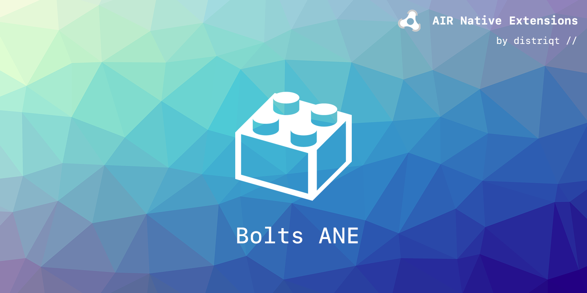

built by [distriqt //](https://airnativeextensions.com) 

# Bolts

Bolts is package ANE that includes the Bolts framework for use in the Facebook and Parse ANE's.

It contains both the Android and iOS version of the Bolts Framework.

See the appropriate ANE documentation for usage of this ANE:

- [FacebookAPI](https://airnativeextensions.com/extension/com.distriqt.FacebookAPI)
- [Parse](https://airnativeextensions.com/extension/com.distriqt.Parse)

## Native Extensions

The highest quality and widest range of Native Extensions for Adobe AIR

With over 40 extensions available, we are the largest provider of native extensions for AIR developers. 
Our mobile solutions allow developers to fast-forward development and focus on building great games and apps.

[airnativeextensions.com](https://airnativeextensions.com)

## License

distriqt retains all copyright.
